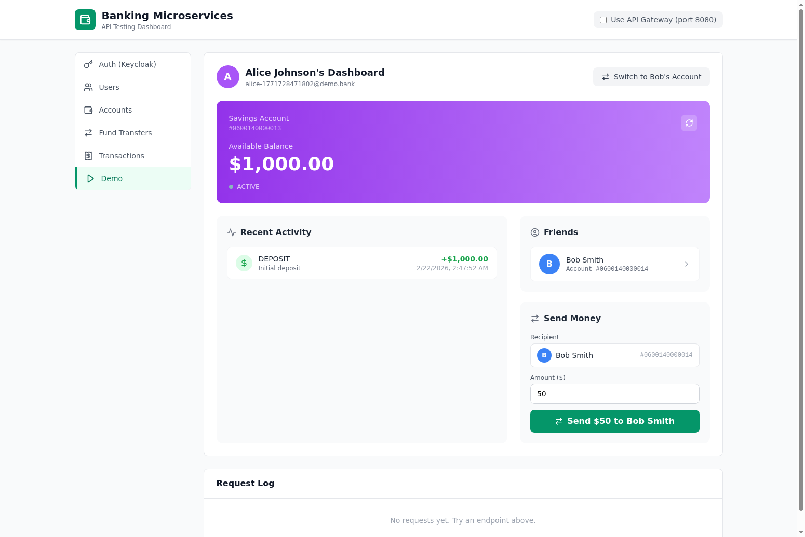

<h1 align="center">🌟 Spring-Boot-Microservices-Banking-Application 🌟</h1>

## 🖥️ Frontend Dashboard

This project includes a **React + TypeScript + Tailwind CSS** frontend (`banking-frontend/`) that provides a browser-based UI for interacting with all the banking microservices. No need for Postman or curl — just open the dashboard and start testing.

### Features

- **Auth** — Obtain JWT tokens from Keycloak for authenticated API Gateway requests
- **Users** — Register, view, update users and manage user status
- **Accounts** — Create savings accounts, check balances, activate/close accounts
- **Fund Transfers** — Send money between accounts and view transfer history
- **Transactions** — Make deposits and withdrawals, view transaction history
- **Demo** — An interactive demo with two pre-seeded users (Alice & Bob) that showcases the full banking flow: account setup, sending money, and switching between user dashboards to see real-time balance updates
- **Request Log** — Every API call is logged at the bottom of the page with method, URL, status code, and full response body
- **Gateway Toggle** — Switch between calling microservices directly or routing through the API Gateway with JWT auth

### Quick Start

**Prerequisites:** All 7 backend microservices and Keycloak must be running before starting the frontend.

#### 1. Start the backend services

Make sure you have the following installed:
- **Java 17**
- **Maven**
- **MySQL** (running on port 3306 with root/root credentials)
- **Docker** (for Keycloak)

**Start Keycloak** (Docker):

```bash
docker run -d --name keycloak -p 8571:8080 \
  -e KEYCLOAK_ADMIN=admin -e KEYCLOAK_ADMIN_PASSWORD=admin \
  quay.io/keycloak/keycloak:21.1.2 start-dev
```

Then configure the `banking-service` realm, clients, and roles as described in the [Keycloak setup guide](https://devscribbles.hashnode.dev/mastering-microservices-authentication-and-authorization-with-keycloak).

**Create the MySQL databases** (one per microservice):

```sql
CREATE DATABASE user_service;
CREATE DATABASE account_service;
CREATE DATABASE fund_transfer_service;
CREATE DATABASE transaction_service;
CREATE DATABASE sequence_generator;
```

**Build and start all services** (from the repo root):

```bash
# Build all services
for dir in Service-Registry API-Gateway Sequence-Generator User-Service Account-Service Fund-Transfer Transaction-Service; do
  (cd $dir && mvn clean package -DskipTests)
done

# Start them in order (each in its own terminal)
java -jar Service-Registry/target/serviceregistry-*.jar      # port 8761
java -jar API-Gateway/target/apigateway-*.jar                # port 8080
java -jar Sequence-Generator/target/sequencegenerator-*.jar  # port 8083
java -jar User-Service/target/userservice-*.jar              # port 8082
java -jar Account-Service/target/accountService-*.jar        # port 8081
java -jar Fund-Transfer/target/fundtransfer-*.jar            # port 8085
java -jar Transaction-Service/target/transactions-*.jar      # port 8084
```

Wait until all services are registered on the Eureka dashboard at **http://localhost:8761**.

#### 2. Start the frontend

```bash
cd banking-frontend
npm install
npm run dev
```

Then open **http://localhost:5173** in your browser.

> **Note:** The frontend runs in development mode only (`npm run dev`). The Vite dev server proxies API requests to the backend services to avoid CORS issues. A production build is not currently supported since it would require a separate backend proxy or CORS configuration on each microservice.

### Using the Demo Tab

The **Demo** tab provides a one-click setup that:

1. Registers two users (Alice & Bob) with full profiles
2. Approves both users
3. Creates savings accounts for each
4. Deposits $1,000 into each account
5. Activates both accounts

After setup, you'll see Alice's dashboard with her balance, recent activity, and a friends list showing Bob. Use the **Send Money** component to transfer funds to Bob, then click **"Switch to Bob's Account"** in the upper right to see his updated balance and the incoming transfer in his activity feed.



---

## 📡 API Endpoints

All services are accessible directly or through the API Gateway (`http://localhost:8080`) with a JWT Bearer token.

### 👤 User Service (port 8082)

Base path: `/api/users`

| Method | Endpoint | Description |
|--------|----------|-------------|
| `POST` | `/api/users/register` | Register a new user (creates in both MySQL and Keycloak) |
| `GET` | `/api/users` | List all users |
| `GET` | `/api/users/{userId}` | Get user by ID |
| `GET` | `/api/users/auth/{authId}` | Get user by Keycloak auth ID |
| `GET` | `/api/users/accounts/{accountId}` | Get user by account number |
| `PUT` | `/api/users/{id}` | Update user profile (firstName, lastName, contactNo, address, gender, occupation, martialStatus, nationality) |
| `PATCH` | `/api/users/{id}` | Update user status (`PENDING`, `APPROVED`, `DISABLED`, `REJECTED`) |

### 💼 Account Service (port 8081)

Base path: `/accounts`

| Method | Endpoint | Description |
|--------|----------|-------------|
| `POST` | `/accounts` | Create a new account (requires `userId` and `accountType`) |
| `GET` | `/accounts?accountNumber={num}` | Get account by account number |
| `GET` | `/accounts/{userId}` | Get account by user ID (only works for ACTIVE accounts) |
| `GET` | `/accounts/balance?accountNumber={num}` | Get account balance |
| `GET` | `/accounts/{accountId}/transactions` | Get transactions for an account |
| `PUT` | `/accounts?accountNumber={num}` | Update account details |
| `PATCH` | `/accounts?accountNumber={num}` | Update account status (`PENDING`, `ACTIVE`, `BLOCKED`, `CLOSED`) — activation requires balance >= 1000 |
| `PUT` | `/accounts/closure?accountNumber={num}` | Close an account |

### 💸 Fund Transfer Service (port 8085)

Base path: `/fund-transfers`

| Method | Endpoint | Description |
|--------|----------|-------------|
| `POST` | `/fund-transfers` | Initiate a fund transfer (requires `fromAccount`, `toAccount`, `amount`) |
| `GET` | `/fund-transfers?accountId={num}` | List all transfers for an account |
| `GET` | `/fund-transfers/{referenceId}` | Get transfer details by reference ID |

### 💳 Transaction Service (port 8084)

Base path: `/transactions`

| Method | Endpoint | Description |
|--------|----------|-------------|
| `POST` | `/transactions` | Create a transaction — deposit or withdrawal (requires `accountId`, `transactionType`, `amount`) |
| `POST` | `/transactions/internal` | Record internal transfer transactions (used by Fund Transfer service) |
| `GET` | `/transactions?accountId={num}` | List transactions for an account |
| `GET` | `/transactions/{referenceId}` | Get transactions by reference ID |

### 🔢 Sequence Generator (port 8083)

Base path: `/sequence`

| Method | Endpoint | Description |
|--------|----------|-------------|
| `POST` | `/sequence` | Generate the next account number (returns incrementing sequence used by Account Service) |

<h2>📋 Table of Contents</h2>

- [🖥️ Frontend Dashboard](#-frontend-dashboard)
- [📡 API Endpoints](#-api-endpoints)
- [🔍 About](#-about)
- [🏛️ Architecture](#-architecture)
- [🚀 Microservices](#-microservices)
- [🚀 Getting Started](#-getting-started)
- [📖 Documentation](#-documentation)
- [⌚ Future Enhancement](#-future-enhancement)
- [🤝 Contribution](#-contribution)
- [📞 Contact Information](#-contact-information)

## 🔍 About
<p>
    The Banking Application is built using a microservices architecture, incorporating the Spring Boot framework along with other Spring technologies such as Spring Data JPA, Spring Cloud, and Spring Security, alongside tools like Maven for dependency management. These technologies play a crucial role in establishing essential components like Service Registry, API Gateway, and more.<br><br>
    Moreover, they enable us to develop independent microservices such as the user service for user management, the account service for account generation and other related functionalities, the fund transfer service for various transfer operations, and the transaction service for viewing transactions and facilitating withdrawals and deposits. These technologies not only streamline development but also enhance scalability and maintainability, ensuring a robust and efficient banking system.
</p>

## 🏛️ Architecture

- **Service Registry:** The microservices uses the discovery service for service registration and service discovery, this helps the microservices to discovery and communicate with other services, without needing to hardcode the endpoints while communicating with other microservices.

- **API Gateway:** This microservices uses the API gateway to centralize the API endpoint, where all the endpoints have common entry point to all the endpoints. The API Gateway also facilitates the Security inclusion where the Authorization and Authentication for the Application.

- **Database per Microservice:** Each of the microservice have there own dedicated database. Here for this application for all the microservices we are incorparating the MySQL database. This helps us to isolate each of the services from each other which facilitates each services to have their own data schemas and scale each of the database when required.


<h2>🚀 Microservices</h2>

- **👤 User Service:** The user microservice provides functionalities for user management. This includes user registration, updating user details, viewing user information, and accessing all accounts associated with the user. Additionally, this microservice handles user authentication and authorization processes.

- **💼 Account Service:** The account microservice manages account-related APIs. It enables users to modify account details, view all accounts linked to the user profile, access transaction histories for each account, and supports the account closure process.

- **💸 Fund Transfer Service:** The fund transfer microservice facilitates various fund transfer-related functionalities. Users can initiate fund transfers between different accounts, access detailed fund transfer records, and view specific details of any fund transfer transaction.

- **💳 Transactions Service:** The transaction service offers a range of transaction-related services. Users can view transactions based on specific accounts or transaction reference IDs, as well as make deposits or withdrawals from their accounts.

<h2>🚀 Getting Started</h2>

To get started, follow these steps to run the application on your local application:

- Make sure you have Java 17 installed on your system. You can download it from the official Oracle website.
- Select an Integrated Development Environment (IDE) such as Eclipse, Spring Tool Suite, or IntelliJ IDEA. Configure the IDE according to your preferences.
- Clone the repository containing the microservices onto your local system using Git. Navigate to the directory where you have cloned the repository.
- Navigate to each microservice directory within the cloned repository and run the application. You can do this by using your IDE or running specific commands depending on the build tool used (e.g., Maven or Gradle).
- Set up Keycloak for authentication and authorization. Refer to the detailed configuration guide provided [here](https://devscribbles.hashnode.dev/mastering-microservices-authentication-and-authorization-with-keycloak) for step-by-step instructions on configuring Keycloak for your microservices.
- Some microservices and APIs may depend on others being up and running. Ensure that all necessary microservices and APIs are up and functioning correctly to avoid any issues in the application workflow.

<h2>📖 Documentation</h2>
<h3>📂 Microservices Documentation</h3>

For detailed information about each microservice, refer to their respective README files:

- [👤 User Service](./User-Service/README.md)
- [💼 Account Service](./Account-Service/README.md)
- [💸 Fund Transfer Service](./Fund-Transfer/README.md)
- [💳 Transactions Service](./Transaction-Service/README.md)

<h3>📖 API Documentation</h3>

For a detailed guide on API endpoints and usage instructions, explore our comprehensive [API Documentation](https://app.theneo.io/student/spring-boot-microservices-banking-application). This centralized resource offers a holistic view of the entire banking application, making it easier to understand and interact with various services.

<h3>📚 Java Documentation (JavaDocs)</h3>

Explore the linked [Java Documentation](https://kartik1502.github.io/Spring-Boot-Microservices-Banking-Application/) to delve into detailed information about classes, methods, and variables across all microservices. These resources are designed to empower developers by providing clear insights into the codebase and facilitating seamless development and maintenance tasks.

## ⌚ Future Enhancement

As part of our ongoing commitment to improving the banking application, we are planning several enhancements to enrich user experience and expand functionality:

- Implementing a robust notification system will keep users informed about important account activities, such as transaction updates, account statements, and security alerts. Integration with email and SMS will ensure timely and relevant communication.
- Adding deposit and investment functionalities will enable users to manage their savings and investments directly through the banking application. Features such as fixed deposits, recurring deposits, and investment portfolio tracking will empower users to make informed financial decisions.
- and more....

<h2>🤝 Contribution</h2>

Contributions to this project are welcome! Feel free to open issues, submit pull requests, or provide feedback to enhance the functionality and usability of this banking application. Follow the basic PR specification while creating a PR.

Let's build a robust and efficient banking system together using Spring Boot microservices!

Happy Banking! 🏦💰

<h2>📞 Contact Information</h2>

If you have any questions, feedback, or need assistance with this project, please feel free to reach out to me:

[](https://wa.me/6361921186)
[](mailto:kartikkulkarni1411@gmail.com)

We appreciate your interest in our project and look forward to hearing from you. Happy coding!
